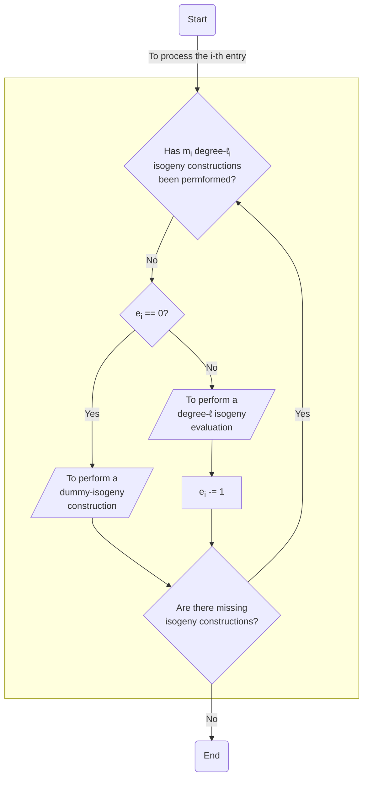

# CSIDH, the Commutative SIDH protocol

---

Go to the [Previous page](../notes.md)
In 2018, Castryck, Lange, Martindale, Panny, and Renes proposed the CSIDH protocol [&#x5b;1&#x5d;](#CLMPR18), which can be viewed as a reinterpretation of Couveignes [&#x5b;3&#x5d;](#CouveignesXX) and Rostovtsev-Stolbunov [&#x5b;2](#BDLS20), [1&#x5d;](#ACDRH20) schemes but this time using supersingular curves defined over a prime field. 

The most demanding computational task of CSIDH is evaluating its class group action, whose cost is dominated by performing a number of degree-&#x2113; isogeny constructions/evaluations [^1].

Let E &#x2f; Fp : By2 = x3 + Ax2 + x be a supersingular elliptic curve with (p + 1) rational points, and m &#x220A; Z. Then, CSIDH can be summarized as follows: 

[^1]: You can deep into the isogeny constructions/evaluations on Montgomery curves by reading [&#x5b;4&#x5d;](#CH17) and [&#x5b;2](#BDLS20), [1&#x5d;](#ACDRH20) for the traditional and the new sqrt V&eacute;lu formul&aelig;, respectively.

---

**References**
:  [1] G. Adj, J.-J. Chi-Dom&iacute;nguez, F. Rodr&iacute;guez-Henr&iacute;quez, **On new V&eacute;lu's formulae and their applications to CSIDH and B-SIDH constant-time implementations**. _IACR Cryptol. ePrint Arch._, 2020: 1109 (2020) [&#128279;](https://eprint.iacr.org/2020/1109).
:  [2] D. J. Bernstein, L. De Feo, A. Leroux, B. Smith, **Faster computation of isogenies of large prime degree**. _IACR Cryptol. ePrint Arch._, 2020: 341 (2020) [&#128279;](https://eprint.iacr.org/2020/341).
:  [3] W. Castryck, T. Lange, C. Martindale, L. Panny, J. Renes, ** CSIDH: An Efficient Post-Quantum Commutative Group Action**. _Advances in Cryptology - ASIACRYPT 2018_, LNCS 11274, 395-427, 2018 [&#128279;](https://doi.org/10.1007/978-3-030-03332-3_15). 
:  [4] C. Costello, H&uuml;seyin Hisil, **A Simple and Compact Algorithm for SIDH with Arbitrary Degree Isogenies**. _Advances in Cryptology - ASIACRYPT 2017_, LNCS 10625, 303-329, 2017 [&#128279;](https://doi.org/10.1007/978-3-319-70697-9_11).

---
