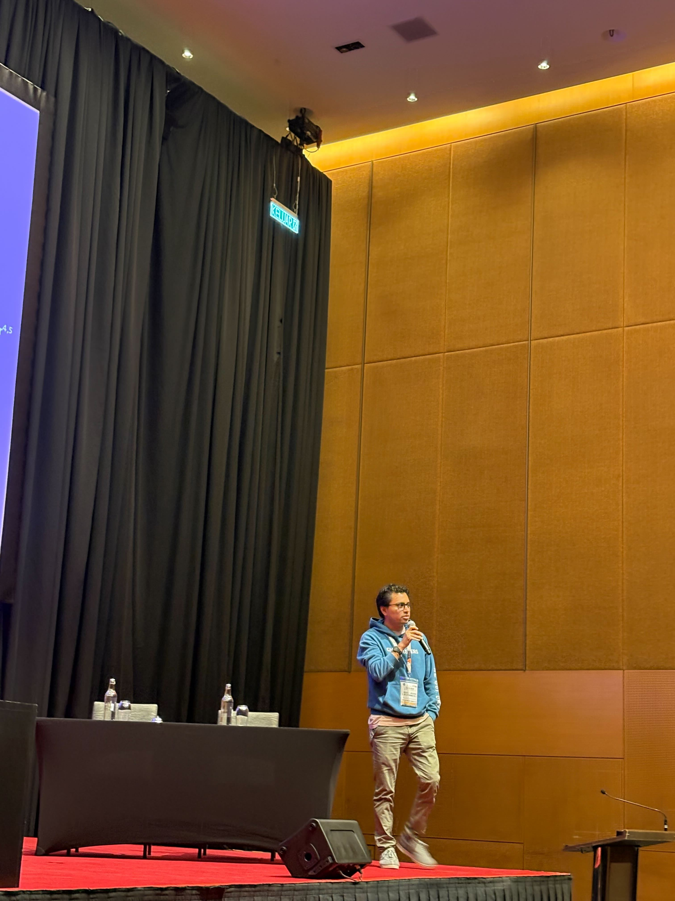

# This is me!

<h4 align="center" class="text-muted">Jes&uacute;s-Javier Chi-Dom&iacute;nguez</h4>

**Last update:** September 26, 2025 | **Curriculum Vitae:** 

---

I am working as _Senior Cryptographer Post Quantum_ at the [Cryptography Research Center (CRC)](https://www.tii.ae/cryptography) of the [Technology Innovation Institute (**TII**)](https://www.tii.ae/), Abu Dhabi, United Arab Emirates.

My research is currently focused on the cryptanalysis and constant-time C-code implementations of elliptic-curve and isogeny-based cryptographic protocols,
where constant-time means its running-time is independent (or it does depend on randomness non-correlated) from its input. My current research also includes code-based and lattice-based cryptography. In general, I focus on post quantum cryptography.

Additionally, I am participating in the NIST competition for "Post-Quantum Cryptography: Digital Signature Schemes (Round 2 Additional Signatures)" as a collaborator of the [Mirath](https://pqc-mirath.org/) and [RYDE](https://pqc-ryde.org/) submissions.

I got a bachelor's degree in mathematics in 2013 at the [Faculty of Mathematics of the Autonomous University of Yucatan](https://www.matematicas.uady.mx/).
I moved to computer sciences for the master's and Ph.D. degrees, both of them were coursed at the [Cinvestav - IPN](https://www.cinvestav.mx/zacatenco/computacion).
I did postdoctoral research stay at [Tampere University, Finland](https://www.tuni.fi/en) where I worked on the (mathematical, and probabilistic) study of
side-channel analysis applied to both existing and emerging cryptosystems.

## Conferences where I am or was a PC member

1. CHES 2025, September 2025, Kuala Lumpur, Malaysia [&#x1F30E;](https://ches.iacr.org/2025/)
2. CHES 2024, September 2024, Halifax, Canada [&#x1F30E;](https://ches.iacr.org/2024/)
3. Latincrypt 2023, October 4–6, 2023, Sangolqu&iacute;, Ecuador [&#x1F30E;](https://www.espe.edu.ec/latincrypt/)
4. CHES 2023, September 2023, Prague, Czech Republic [&#x1F30E;](https://ches.iacr.org/2023/)
5. Criptolatin Workshop: The Latin American community of cryptographers (CLW), October 9, 2021, Virtual [&#x1F30E;](https://www.criptolatino.org)
6. Latincrypt 2021, October 6–8, 2021, Bogota, Colombia [&#x1F30E;](https://urosario.edu.co/Latin-Crypt/inicio/)

---

 
 
 

_Gracias_ for taking your time in reading my short Bio!